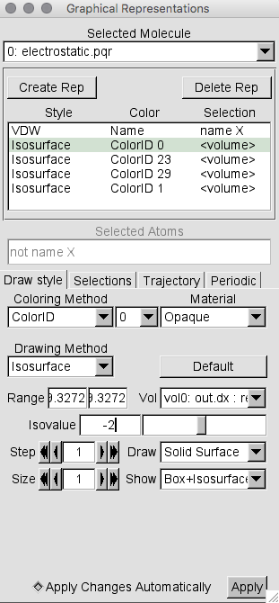
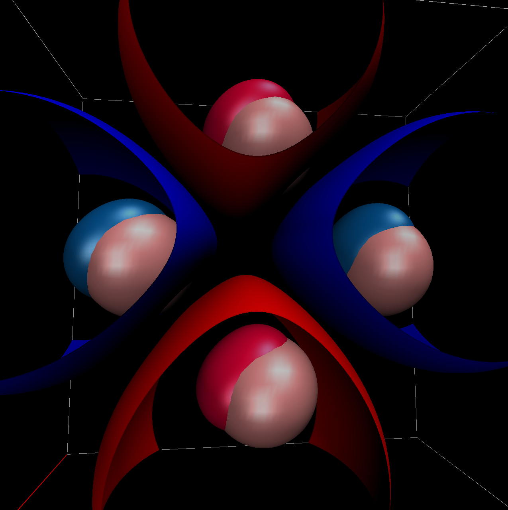

Analysis Tools
==============

Viewing PQR in VMD
------------------

First, open VMD and load the PQR file by selecting File > New Molecule on the toolbar and entering the path to the PQR file in the Filename section. Then select Graphics > Representations on the toolbar.  In the Selected Atoms selection of the pop-up, type::

 not name X

This tells VMD to remove the coarse grained spheres from the current representation.  Change the Coloring Method to Charge and the Drawing Method
to VDW. Now, to add the coarse grained spheres back into the image, select the Create Rep button and in the Selected Atoms section type::

 name X

Change the Drawing Method of the new representation to VDW and the Material to Transparent. You should now see a collection of charges inside
transparent coarse grained spheres. The final view of the Graphical Representations screen and the ouput image after this process are shown below.

.. image:: images/vmd_graph_rep_pqr.png
   :width: 30%

.. image:: images/vmd_4sp.png
   :width: 66%

Viewing Electrostatics in VMD
-----------------------------

To view the electrostatic results, first follow the steps above to load the PQR file. Then load the .dx file by selecting File > New Molecule on the toolbar, using the Load Files For toggle to select the previously loaded PQR and then entering the path to the .dx file in the Filename section. We will now use the .dx file to draw isosurfaces representing the surface in which the system has a selected charge. First, open the Graphical Representation screen again and select the Create Rep button. Now change the Drawing Method to Isosurface. Now in the new Draw toggle, select Solid Surface. Move the Value bar to change the charge that the isosurface represents. Change the Coloring Method to ColorID and then select the color by entering a ColorID number
in the box that appears next to the Coloring Method toggle. You may also toggle through the options by expanding this box. You may add an arbritary number
of isosurfaces by again pressing Create Rep and choosing a new Value and ColorID. The final view of the Graphical Representations screen and the ouput image after this process are shown below.

