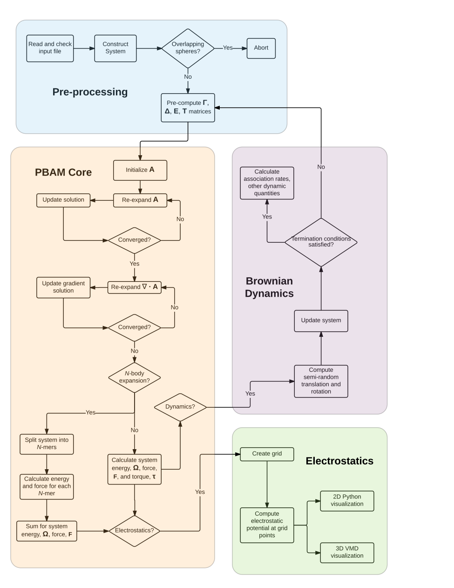

PB-AM Program details
=====================

Some details about the code: it is written in C++11 and it
has some linear algebra utilities and OMP parallelism implemented.

Below is a flow diagram of the program from call to finish.

